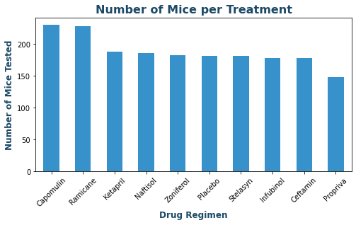

# matplotlib-challenge

Background
You've just joined Pymaceuticals, Inc., a new pharmaceutical company that specializes in anti-cancer medications. Recently, it began screening for potential treatments for squamous cell carcinoma (SCC), a commonly occurring form of skin cancer.

As a senior data analyst at the company, you've been given access to the complete data from their most recent animal study. In this study, 249 mice who were identified with SCC tumors received treatment with a range of drug regimens. Over the course of 45 days, tumor development was observed and measured. The purpose of this study was to compare the performance of Pymaceuticals’ drug of interest, Capomulin, against the other treatment regimens.

The executive team has tasked you with generating all of the tables and figures needed for the technical report of the clinical study. They have also asked you for a top-level summary of the study results.

Instructions
This assignment is broken down into the following tasks:

* Prepare the data.

* Generate summary statistics.

* Create bar charts and pie charts.

* Calculate quartiles, find outliers, and create a box plot.

* Create a line plot and a scatter plot.

* Calculate correlation and regression.

* Submit your final analysis.

# Pymaceuticals Inc.

## Analysis

* There isn’t a big gap of variations between all 10 drug regimens. But Ramicane, Capomulin, Ceftamin and Infubinol have lower standard deviation and SEM less than 0.5. Compared to the other drugs those 4 drug regimens have more reliability.
* Capomulin and Ramicane have the highest number of mice tested, 230 and 228 respectively whereas, Propriva had the least with only 148 mice tested.
* Distribution of female versus male mice is fair with only 2% difference. Male 51%  vs Female 49%.
* A case study for Capomulin treated mice ‘IS09, showed 3 picks in 3 different day ranges. 
    1.	First pick: tumor size increased 45 to 48 from first to day 20. Decreased to 44 after day 20 
    2.	Second pick: increased by 1 mm3 after day 30 and the tumor decreased to its lowest volume close to 40mm3. 
    3.	Third pick: tumor volume was increased to 42 mm3 after day 40.
It’s hard to conclude that the regimen was effective as the tumor kept on growing back.

* In conclusion, there is a strong correlation between mouse weight and the average tumor volume for the Capomulin regimen which is 0.84.

# Charts

# Bar Charts and Pie Charts

# Boxplots

# Line Plot and Scatter Plot

# Correlation and Regression
